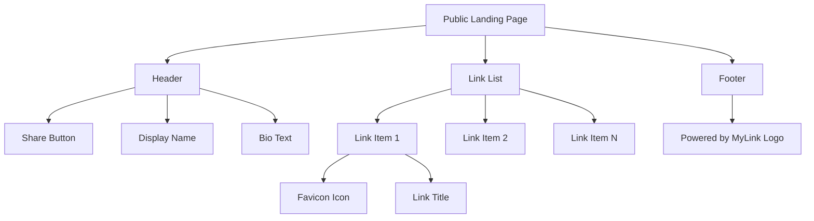
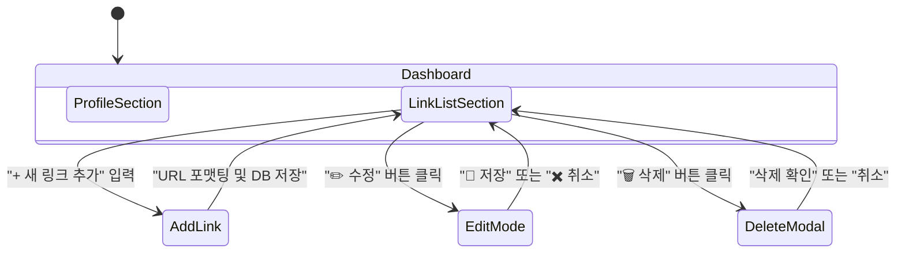
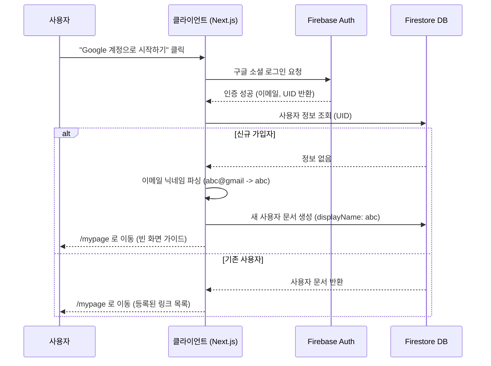

# 마이링크 (MyLink) - 화면 와이어프레임 (Wireframe)

이 문서는 MVP 개발을 위한 마이링크 서비스의 핵심 화면들의 레이아웃, 컴포넌트 구조, 그리고 주요 상호작용을 정의합니다.

---

## 1. 퍼블릭 랜딩 페이지 (방문자 화면)
* **경로**: `/닉네임` (예: `mylink.com/leo`)
* **목적**: 방문자가 소유자의 링크들을 확인하고 클릭하여 이동하는 화면입니다.

### 🎨 시각적 레이아웃 (ASCII Art)
```text
+-------------------------------------------------+
|                                                 |
|                                    [공유 🔗]      |
|                                                 |
|                  닉네임 (Bold)                    |
|             소개글(Bio)이 들어가는 자리               |
|            여러 줄로 작성될 수 있습니다.              |
|                                                 |
|  +-------------------------------------------+  |
|  | [파비콘] 내 포트폴리오 웹사이트 가기            |  |
|  +-------------------------------------------+  |
|                                                 |
|  +-------------------------------------------+  |
|  | [파비콘] 유튜브 채널 구독하기                  |  |
|  +-------------------------------------------+  |
|                                                 |
|  +-------------------------------------------+  |
|  | [파비콘] 추천하는 아이템 구매 링크              |  |
|  +-------------------------------------------+  |
|                                                 |
|               Powered by MyLink                 |
|                                                 |
+-------------------------------------------------+
```

### 🧱 컴포넌트 구조도 (Mermaid)


### 🔹 상세 명세 (Markdown)
* **공유하기 버튼 (Share Button)**: 우측 상단 배치. 클릭 시 URL을 클립보드에 복사하고 Toast 알림(`shadcn/ui` Toast) 발생.
* **헤더 영역 (Header)**: 닉네임과 Bio가 중앙 정렬로 표시됩니다.
* **링크 아이템 (Link Item)**: 세로로 나열된 버튼 형식(`shadcn/ui` Button 혹은 Card). 좌측에 Google Favicon API를 통해 가져온 파비콘 이미지가 렌더링 됩니다.

---

## 2. 관리자 대시보드 (소유자 화면)
* **경로**: `/mypage`
* **목적**: 소유자가 자신의 프로필을 설정하고 링크를 관리하는 메인 화면입니다.

### 🎨 시각적 레이아웃 (ASCII Art)
```text
+-------------------------------------------------+
|  [MyLink 로고]                  [로그아웃/설정]  |
+-------------------------------------------------+
|                                                 |
|  [ 👤 프로필 설정 ]                             |
|  닉네임: [ input: leo                 ]         |
|  소개글: [ textarea: 소개글을 입력하세요... ]         |
|                                [ 저장하기 ]       |
|                                                 |
|  ---------------------------------------------  |
|                                                 |
|  [ 🔗 링크 관리 ]                               |
|                                                 |
|  +-------------------------------------------+  |
|  | URL:  [ input: my-portfolio.com      ]    |  |
|  | 제목:  [ input: 링크 제목 입력        ]    |  |
|  |                        [ + 새 링크 추가 ]  |  |
|  +-------------------------------------------+  |
|                                                 |
|  (등록된 링크 목록)                               |
|  +-------------------------------------------+  |
|  | [파비콘] 내 포트폴리오 웹사이트 가기            |  |
|  | URL: https://my-portfolio.com             |  |
|  |                       [✏️ 수정] [🗑️ 삭제]  |  |
|  +-------------------------------------------+  |
|                                                 |
|  (수정 모드 진입 시)                              |
|  +-------------------------------------------+  |
|  | 제목: [ input: 유튜브 채널 구독하기   ]       |  |
|  | URL: [ input: https://youtube...    ]     |  |
|  |                       [💾 저장] [✖️ 취소]   |  |
|  +-------------------------------------------+  |
|                                                 |
+-------------------------------------------------+
```

### 🔄 상호작용 흐름 (Mermaid)


### 🔹 상세 명세 (Markdown)
* **새 링크 추가**: URL과 제목을 입력하고 추가 버튼을 누르면 목록 최상단에 등록됩니다. (URL에 `http://` 누락 시 자동 추가 포맷팅)
* **수정 모드 (Edit Mode)**: 연필 아이콘 클릭 시 해당 아이템 영역이 텍스트 대신 **입력 폼(Input)** 으로 교체되어 인라인 편집이 가능합니다.
* **삭제 확인 팝업**: 휴지통 아이콘 클릭 시 `shadcn/ui`의 `AlertDialog` 모달 창이 나타나 "정말 삭제하시겠습니까?"를 묻습니다.
* **빈 화면 (Empty State)**: 등록된 링크가 없을 경우, "아직 추가된 링크가 없습니다. 첫 번째 링크를 추가해 보세요!"라는 가이드 문구가 노출됩니다.

---

## 3. 메인 랜딩 (로그인 화면)
* **경로**: `/`
* **목적**: 서비스 소개 및 최초 사용자 유입, 소셜 로그인을 담당합니다.

### 🎨 시각적 레이아웃 (ASCII Art)
```text
+-------------------------------------------------+
|  [MyLink 로고]                                  |
+-------------------------------------------------+
|                                                 |
|                                                 |
|           하나의 링크로 모든 것을 연결하세요.          |
|           나만의 프로필 페이지를 무료로 만드세요.      |
|                                                 |
|         [ 🔴 Google 계정으로 1초만에 시작하기 ]    |
|                                                 |
|                                                 |
+-------------------------------------------------+
```

### 🔐 인증 흐름도 (Mermaid)


### 🔹 상세 명세 (Markdown)
* **소셜 로그인**: 구글 로그인 버튼 클릭 시 Firebase Auth 창이 실행됩니다.
* **초기 닉네임 파싱**: 가입 이력이 없는 신규 사용자일 경우, 구글 이메일의 앞부분(`@` 이전)을 추출하여 닉네임을 자동 지정하고 데이터베이스에 저장한 후 대시보드(`/mypage`)로 자동 진입시킵니다.
